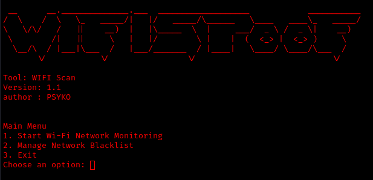

# Wi-Fi Network Monitoring Tool

This Python script provides functionalities to monitor Wi-Fi networks, detect fraudulent networks, manage trusted networks, and maintain a blacklist of networks.



## Features

- **Wi-Fi Network Monitoring:** Continuously scans and displays available Wi-Fi networks.
- **Fraudulent Network Detection:** Detects potentially fraudulent Wi-Fi networks based on signal strength, encryption type, and comparison with trusted networks.
- **Email Notifications:** Sends email notifications when fraudulent networks or blacklisted networks are detected.
- **Trusted Networks Management:** Allows users to add and remove trusted Wi-Fi networks based on SSID and BSSID.
- **Blacklist Management:** Enables users to maintain a blacklist of Wi-Fi networks to avoid.

## Prerequisites

- Python 3.x
- `plyer` module: Install using `pip install plyer` for notifications.

## Setup

1. Clone the repository:

   ```bash
   git clone https://github.com/your_username/wifi-monitor.git
   cd wifi-monitor
   ```

2. Install dependencies:

   ```bash
   pip install -r requirements.txt
   ```

3. Run the script:

   ```bash
   python wifi_monitor.py
   ```

## Usage

1. **Main Menu:**
   - **Start Wi-Fi Network Monitoring:** Begins monitoring Wi-Fi networks.
   - **Manage Network Blacklist:** Allows adding/removing networks from the blacklist.
   - **Exit:** Stops the script.

2. **Monitoring Networks:**
   - Networks are continuously scanned and displayed.
   - Fraudulent networks trigger notifications and emails to alert users.
   - Signal strength and encryption details are logged.

3. **Managing Trusted Networks:**
   - Add or remove trusted networks to avoid false fraud alerts.

4. **Managing Blacklist:**
   - Add or remove networks to/from the blacklist to ignore problematic networks.

## Configuration

- Configure email settings in `wifi_monitor.py` (`send_email_notification` function) for notifications.

## Example

```bash
python wifi_monitor.py
```

## License

This project is licensed under the MIT License - see the LICENSE file for details.
